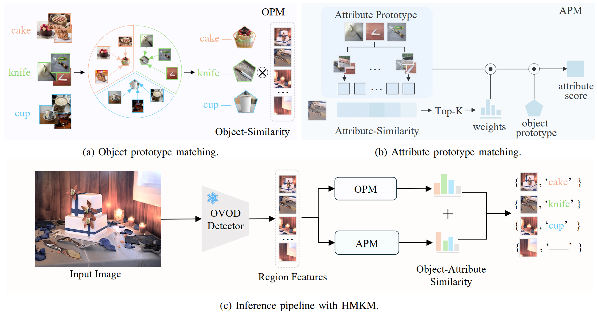

# HMKM
The official implementation of Hierarchical Multimodal Knowledge Matching for Training-Free Open-Vocabulary Object Detection.

  

## Installation

### Requirements
- Linux or macOS with Python ≥ 3.7
- PyTorch ≥ 1.9.
  Install them together at [pytorch.org](https://pytorch.org) to make sure of this. Note, please check
  PyTorch version matches that is required by Detectron2.
- Detectron2: follow [Detectron2 installation instructions](https://detectron2.readthedocs.io/tutorials/install.html).

HMKM is a training-free module that can be easily integrated into various open-vocabulary object detection frameworks, such as [Detic](https://github.com/facebookresearch/Detic), [VLDet](https://github.com/clin1223/VLDet), and [MM-OVOD](https://github.com/prannaykaul/mm-ovod).
To use HMKM, please first set up the corresponding environment following the installation instructions of each base framework (e.g, [Detic](https://github.com/facebookresearch/Detic), [CoDet](https://github.com/CVMI-Lab/CoDet)). After that, add the HMKM adapter code on top of the chosen framework.

As an example, the official HMKM adaptation code for CoDet will be released in the codet branch.

### Prepare prototype datasets
We follow the data collection protocol of [MM-OVOD](https://github.com/prannaykaul/mm-ovod/blob/main/datasets/README.md) . Specifically, the primary source of category images is ImageNet-21k. When the number of images for a category is insufficient, we randomly sample additional images from the training sets of Visual Genome and LVIS.

## Acknowledgement
This repository was built on top of 
[Detectron2](https://github.com/facebookresearch/detectron2), 
[Detic](https://github.com/facebookresearch/Detic), 
[VLDet](https://github.com/clin1223/VLDet), 
[CoDet](https://github.com/CVMI-Lab/CoDet), 
[MM-OVOD](https://github.com/prannaykaul/mm-ovod),
[BARON](https://github.com/wusize/ovdet).
We sincerely thank them for their work and contributions.